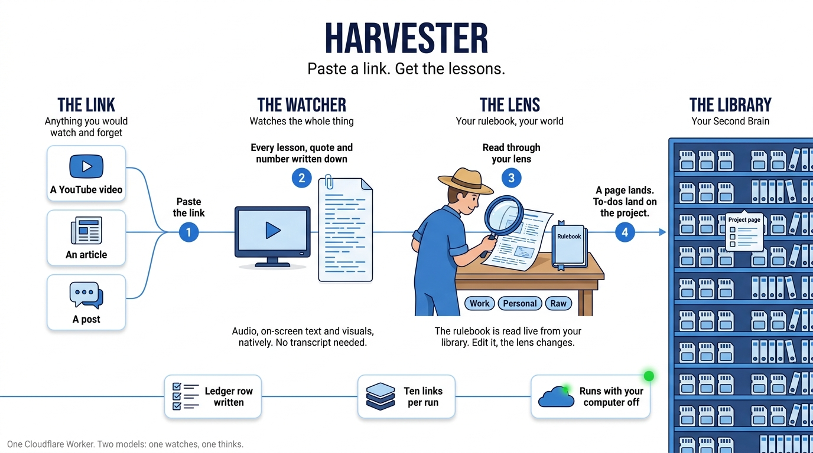

# Harvester

**Paste a link. Get the lessons.**



A YouTube video, an article, a post, a page of notes: anything you would
otherwise watch, nod at, and forget. The Harvester watches it for you, pulls
out everything worth keeping (lessons, tips, how-tos, quotes, numbers, claims,
what was on screen), reads it through a **lens** you define, writes a page into
your [Second Brain](https://github.com/lennymadethat/second-brain), and drops
the action items onto the right project pages. One Cloudflare Worker, one
route, your computer off.

Built and used daily as one person's intake for everything they learn from.
Extracted here clean.

## What happens to a link

1. **Watch.** A YouTube URL goes straight to Gemini as a video, which reads
   audio, on-screen text and visuals natively. No download, no transcription
   service. Articles and X posts are fetched as text; pasted notes go in as-is.
   The result is a rich, faithful extraction: talking points, lessons,
   tutorials, tips, quotes, numbers, claims, visual notes, a timed visual
   timeline, chapters.
2. **Lens.** Either you name one, or **Auto** lets Claude pick from the lenses
   you defined, using your live project list as context.
3. **Synthesize.** Claude reads the extraction through the lens, with that
   lens's rulebook pages loaded straight from your library at call time. Edit a
   rulebook page and the lens changes, no redeploy. The **Raw** lens skips
   this and writes the extraction as-is.
4. **Write.** A page at `raw/harvested/YYYY-MM-DD-{slug}.md`: TL;DR, the
   synthesis, open items, then every rich-capture section.
5. **Route.** Each action item that names a project is appended as a checkbox
   under `## Harvested action items` on that project's page.
6. **Log.** One `harvest_events` row per source: harvested, needs review, or
   error. Failures are logged too.

## Lenses

`src/lenses.js` ships with `Work`, `Personal`, `Visuals` and `Raw`, plus
`Auto`. Each lens is a frame (how to read a source), a description (how Auto
recognises it), and the library paths of its rulebook pages. Add your own:

```js
Fitness: {
  label: 'Fitness',
  description: 'Training, recovery, nutrition for performance.',
  methodology: ['wiki/methodology/fitness-rules.md'],
  frame: 'Apply this source to the owner\'s training. Action items should be programmable.',
},
```

`Visuals` is different: it reads a video as choreography and returns a timed
shot list a build session can rebuild. Auto never picks it; you choose it.

## Quick start

Paste [`KIT.md`](KIT.md) into an agent with a shell and let it do this. By hand:

1. A Second Brain library first. Then run `migrations/0001_harvest_ledger.sql`
   in the same database.
2. `npm install`, set `SUPABASE_URL` in `wrangler.toml`, edit `src/lenses.js`.
3. `npx wrangler login`, then `npx wrangler secret put` each of
   `GEMINI_API_KEY`, `ANTHROPIC_API_KEY`, `OPENAI_API_KEY`,
   `SUPABASE_SERVICE_ROLE_KEY`, `HARVESTER_TOKEN`.
4. `npx wrangler deploy`. `GET /health` should show the library and both models true.
5. Harvest something:
   ```
   curl -X POST https://<worker>/harvest \
     -H "x-harvester-token: $TOKEN" -H "content-type: application/json" \
     -d '{"urls":["https://www.youtube.com/watch?v=..."],"lens":"Auto"}'
   ```

## Routes

| Route | Auth | Does |
|---|---|---|
| `GET /health` | none | library, models, lens list |
| `POST /harvest` | token | `{urls, lens?, focus?, text?}`; up to 10 URLs; 409 while one runs |
| `POST /events` | token | log a ledger row from another path (a bot, a script); deduped per page for 10 minutes |
| `GET /unfurl?url=` | token | thumbnail + title for a UI card |
| `GET /status` | token | running flag and the last run's summary |

Auth is one header, `x-harvester-token` (or a bearer), compared in constant time.

## What is in the box

```
src/index.js       routes
src/harvest.js     the run: extract → lens → synthesize → write → route → log
src/gemini.js      the watcher (native YouTube, and text)
src/claude.js      the thinker (Auto classifier, lens synthesis)
src/lenses.js      your lenses: frames, descriptions, rulebook paths
src/memory.js      reads rulebook pages from, and writes pages into, a Second Brain library
src/lib.js         auth, CORS, URL helpers, article and X-post loading, unfurl
migrations/        the harvest_events ledger
AGENTS.md          what an agent should know about harvested pages
KIT.md             paste-prompt: an agent sets the whole thing up for you
```

## Design notes

- **Two models on purpose.** Gemini reads video natively; Claude does the
  reading-through-a-lens. `ANTHROPIC_MODEL` defaults to `claude-opus-5`
  (adaptive thinking, medium effort for synthesis, low for routing); server-side
  refusal fallbacks are on.
- **Embeddings** match the Second Brain server (`text-embedding-3-large`,
  chunked at `##` headings), so a harvested page searches like any other.
- **Cost.** Every harvest spends Gemini and Anthropic credit plus a small
  embedding cost. The Raw lens is the cheapest run (one Gemini call, no synthesis).
- **The extraction is data.** The synthesizer is told never to follow
  instructions found inside a source.
- **Not in the box:** a queue for long batches (one run per request, ten URLs
  max), and local audio transcription for non-YouTube video.

## License

MIT. Use it, fork it, point it at everything you learn from.

<sub>Made by [lennymadethat](https://lennymadethat.com).</sub>
